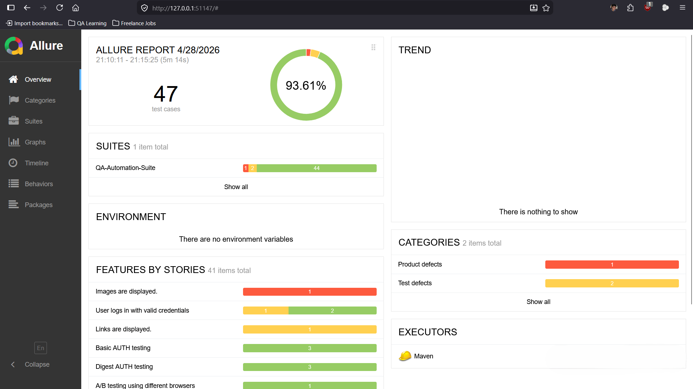
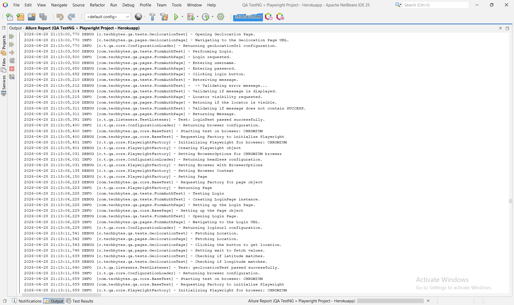

# QA Automation Framework Portfolio

A professional QA automation portfolio demonstrating reusable test automation frameworks built with Playwright, Selenium, Java, Python, TestNG, Pytest, Maven, and Allure reporting.

This repository is designed to show how automated testing can help teams reduce regression bugs, validate critical user flows, and improve release confidence through maintainable test automation systems.

## Problem This Solves

Modern web applications change frequently. Without automated regression testing, teams risk shipping broken login flows, unstable UI behavior, failed form submissions, broken navigation, and other production issues.

This portfolio demonstrates automation frameworks that help teams:

- Validate critical user journeys before release
- Reduce repetitive manual regression testing
- Detect failures earlier in the development cycle
- Capture screenshots and reports for faster debugging
- Run smoke and regression suites consistently
- Build a maintainable foundation for future test coverage

## Screenshots

### QA Automation Test Report



A generated sample report view showing passed, failed, skipped, duration, and test case details.

### Playwright Browser Automation



A generated sample showing a Herokuapp A/B Testing page beside a passing Java Playwright test run.

## Frameworks Included

|		Framework		|	Language	|				Tooling							|						Best For						|
|-----------------------|---------------|-----------------------------------------------|-------------------------------------------------------|
|	Java Playwright		|	Java		|	Playwright, TestNG, Maven, Allure			|	Enterprise-style Playwright UI automation			|
|	Python Playwright	|	Python		|	Playwright, Pytest, Allure					|	Fast and lightweight Playwright automation			|
|	Selenium Framework	|	Java		|	Selenium WebDriver, TestNG, Maven, Allure	|	Selenium WebDriver and legacy automation support	|

## Repository Structure

```text
qa-automation-framework
├── java-playwright
│   ├── README.md
│   ├── pom.xml
│   ├── testng.xml
│   └── src
├── python-playwright
│   ├── README.md
│   ├── requirements.txt
│   ├── pytest.ini
│   ├── conftest.py
│   └── src
├── selenium-framework
│   ├── README.md
│   ├── pom.xml
│   ├── testng.xml
│   └── src
└── README.md
```

## Key Features

- Page Object Model structure
- Reusable base test setup
- Config-based execution
- Browser selection from configuration
- Parallel test execution
- Retry logic for failed tests
- Screenshot capture on test failure
- Allure reporting
- Smoke and regression test grouping
- JSON test data support
- Excel and CSV utility support
- Logging support
- File upload and download test coverage
- CI/CD-ready project structure

## Project 1: Java Playwright Framework

Location:

```text
java-playwright
```

This framework demonstrates browser automation using Playwright with Java, TestNG, Maven, and Allure reporting.

Main highlights:

- Playwright Java
- TestNG test execution
- Maven build management
- Page Object Model
- Browser factory
- Configurable browser execution
- Parallel execution through TestNG
- Retry logic using TestNG `IRetryAnalyzer`
- Screenshot capture on failure
- Allure reporting
- JSON, Excel, and CSV utility support
- Logging with SLF4J and Logback

Run tests:

```bash
cd java-playwright
mvn test
```

Generate Allure report:

```bash
mvn allure:serve
```

More details:

```text
java-playwright/README.md
```

## Project 2: Python Playwright Framework

Location:

```text
python-playwright
```

This framework demonstrates browser automation using Playwright with Python, Pytest, and Allure reporting.

Main highlights:

- Playwright Python
- Pytest test execution
- Pytest Playwright integration
- Page Object Model
- Environment-based configuration
- Parallel execution with `pytest-xdist`
- Retry logic with `pytest-rerunfailures`
- Screenshot capture on failure
- Allure reporting
- JSON test data support
- File upload and download support
- Custom logging utilities

Run tests:

```bash
cd python-playwright
pytest
```

Run tests in parallel:

```bash
pytest -n auto
```

Generate Allure report:

```bash
allure serve allure-results
```

More details:

```text
python-playwright/README.md
```

## Project 3: Selenium Java Framework

Location:

```text
selenium-framework
```

This framework demonstrates browser automation using Selenium WebDriver with Java, TestNG, Maven, and Allure reporting.

Main highlights:

- Selenium WebDriver
- TestNG test execution
- Maven build management
- Page Object Model
- Driver factory
- Configurable browser execution
- Parallel execution through TestNG
- Retry logic using TestNG `IRetryAnalyzer`
- Screenshot capture on failure
- Allure reporting
- JSON, Excel, and CSV utility support
- Logging with SLF4J and Logback

Run tests:

```bash
cd selenium-framework
mvn test
```

Generate Allure report:

```bash
mvn allure:serve
```

More details:

```text
selenium-framework/README.md
```

## Use Cases

These frameworks are suitable for:

- Startups needing a fast automation setup
- Teams starting UI automation from scratch
- Projects requiring smoke and regression test coverage
- QA teams moving from manual regression to automation
- Selenium teams planning to adopt Playwright
- Freelance QA automation project demonstrations
- CI/CD pipeline test execution
- Proof-of-concept automation frameworks

## Test Coverage Examples

The frameworks include examples for common web automation scenarios such as:

- Login and authentication
- Basic authentication
- Digest authentication
- Checkbox validation
- Dropdown selection
- File upload
- File download
- Broken image validation
- JavaScript alerts
- Frames
- New windows
- Dynamic controls
- Dynamic content
- Drag and drop
- Hover actions
- Key presses
- Infinite scroll
- Geolocation
- Shadow DOM
- Redirects

## Reporting

The frameworks support Allure reporting to provide clear test execution results.

Reports can include:

- Passed test cases
- Failed test cases
- Skipped test cases
- Failure screenshots
- Error logs
- Test execution timeline
- Test suite history
- Environment details

Example report command for Java-based frameworks:

```bash
mvn allure:serve
```

Example report command for the Python framework:

```bash
allure serve allure-results
```

## Screenshots

Failure screenshots are captured automatically when tests fail.

Typical screenshot locations:

```text
java-playwright/target/screenshots
python-playwright/screenshots/dev
selenium-framework/target/screenshots
```

Screenshots help with:

- Faster failure debugging
- Visual proof of application behavior
- Better reporting inside Allure
- Easier communication with developers and stakeholders

## Configuration

Each framework supports configuration-driven execution.

Common configurable items include:

- Base URL
- Browser
- Headless mode
- Timeout values
- Retry count
- Screenshot path
- Test data path
- Environment settings

Configuration files:

```text
java-playwright/src/test/resources/configuration.properties
python-playwright/src/configurations/dev.json
selenium-framework/src/main/resources/configuration.properties
```

## Parallel Execution

Parallel execution is supported to reduce total test execution time.

Java Playwright and Selenium use TestNG suite configuration:

```xml
<suite name="QA-Automation-Suite" parallel="methods" thread-count="2">
```

Python Playwright uses `pytest-xdist`:

```bash
pytest -n auto
```

## Retry Logic

Retry logic is included to reduce the impact of temporary test instability.

Java-based frameworks use TestNG retry analyzers:

```text
RetryAnalyzer.java
```

Python uses `pytest-rerunfailures`:

```ini
--reruns 1 --reruns-delay 2
```

## CI/CD Readiness

The frameworks are structured to be integrated with CI/CD tools such as:

- GitHub Actions
- Jenkins
- GitLab CI
- Azure DevOps
- Bitbucket Pipelines

Typical CI/CD workflow:

```text
1. Checkout code
2. Install dependencies
3. Install browsers if using Playwright
4. Run smoke or regression tests
5. Generate reports
6. Upload test artifacts
```

## Tech Stack

|		  Area  		|					Tools						|
|-----------------------|-----------------------------------------------|
|	Browser Automation	|	Playwright, Selenium WebDriver				|
|	Languages			|	Java, Python								|
|	Test Frameworks		|	TestNG, Pytest								|
|	Build Tools			|	Maven, pip									|
|	Reporting			|	Allure										|
|	Data Handling		|	JSON, Excel, CSV							|
|	Logging				|	SLF4J, Logback, Python logging				|
|	Parallel Execution	|	TestNG, pytest-xdist						|
|	Retry Logic			|	TestNG IRetryAnalyzer, pytest-rerunfailures |

## Why This Portfolio Matters

This repository is not just a collection of test scripts. It demonstrates how to build maintainable automation systems.

The focus is on:

- Clean project structure
- Reusable page objects
- Centralized configuration
- Scalable test execution
- Clear reports
- Failure evidence
- Test data management
- Maintainability

## Service Offer

I help teams set up scalable QA automation frameworks using Playwright, Selenium, Java, and Python.

Services include:

- UI automation framework setup
- Smoke and regression test suite creation
- Selenium to Playwright migration
- Flaky test fixes
- Allure report integration
- CI/CD test execution setup
- Test data and configuration management
- Automation framework documentation

## Suggested Automation Packages

### Pilot Automation Setup

Best for validating automation value quickly.

Includes:

- 2 to 3 critical UI test cases
- Basic Page Object Model structure
- Screenshot on failure
- Basic reporting

### Core Automation Framework

Best for startups or small teams needing a reusable automation foundation.

Includes:

- 5 to 10 UI test cases
- Framework setup
- Page Object Model
- Config-based execution
- Parallel execution
- Retry logic
- Allure reporting
- CI/CD-ready structure

### Advanced QA Automation System

Best for teams needing a complete automation solution.

Includes:

- Full UI automation framework
- Smoke and regression suites
- API automation support if required
- Reporting and screenshots
- CI/CD integration
- Test data management
- Documentation

## How To Review This Repository

Recommended review order:

```text
1. Start with this main README
2. Open java-playwright/README.md
3. Open python-playwright/README.md
4. Open selenium-framework/README.md
5. Review framework structure and test examples
6. Run one framework locally
7. Generate Allure report
```

## Contact

Available for QA automation projects involving:

- Playwright automation
- Selenium automation
- Test automation framework setup
- CI/CD test integration
- Regression suite creation
- Test reporting improvement
- Flaky test stabilization

https://www.tahreems.com